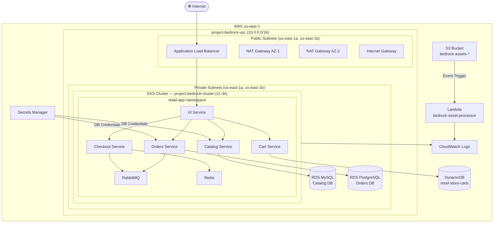

# Architecture Diagram

## To view the diagram, paste the code below at https://mermaid.live

```mermaid
graph TB
    Internet([🌐 Internet]) --> ALB

    subgraph AWS["AWS us-east-1"]
        subgraph VPC["project-bedrock-vpc (10.0.0.0/16)"]
            subgraph PublicSubnets["Public Subnets (us-east-1a, us-east-1b)"]
                ALB[Application Load Balancer]
                NAT1[NAT Gateway AZ-1]
                NAT2[NAT Gateway AZ-2]
                IGW[Internet Gateway]
            end

            subgraph PrivateSubnets["Private Subnets (us-east-1a, us-east-1b)"]
                subgraph EKS["EKS Cluster — project-bedrock-cluster (v1.34)"]
                    subgraph RetailApp["retail-app namespace"]
                        UI[UI Service]
                        Catalog[Catalog Service]
                        Cart[Cart Service]
                        Orders[Orders Service]
                        Checkout[Checkout Service]
                        RabbitMQ[RabbitMQ]
                        Redis[Redis]
                    end
                end

                MySQL[(RDS MySQL\nCatalog DB)]
                Postgres[(RDS PostgreSQL\nOrders DB)]
            end
        end

        DynamoDB[(DynamoDB\nretail-store-carts)]
        S3[S3 Bucket\nbedrock-assets-*]
        Lambda[Lambda\nbedrock-asset-processor]
        CW[CloudWatch Logs]
        SM[Secrets Manager]
    end

    ALB --> UI
    UI --> Catalog
    UI --> Cart
    UI --> Orders
    UI --> Checkout
    Catalog --> MySQL
    Cart --> DynamoDB
    Orders --> Postgres
    Orders --> RabbitMQ
    Checkout --> Redis
    Checkout --> RabbitMQ
    S3 -->|Event Trigger| Lambda
    Lambda --> CW
    EKS --> CW
    SM -->|DB Credentials| Catalog
    SM -->|DB Credentials| Orders
```
